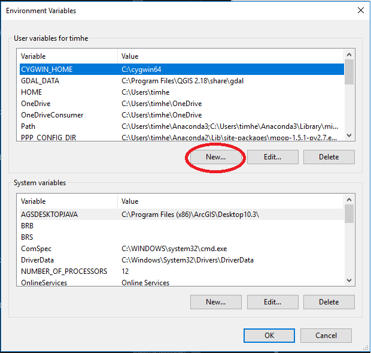
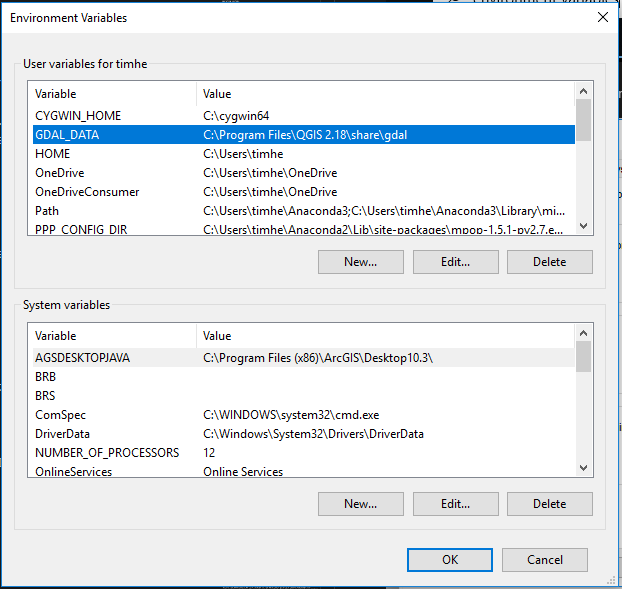
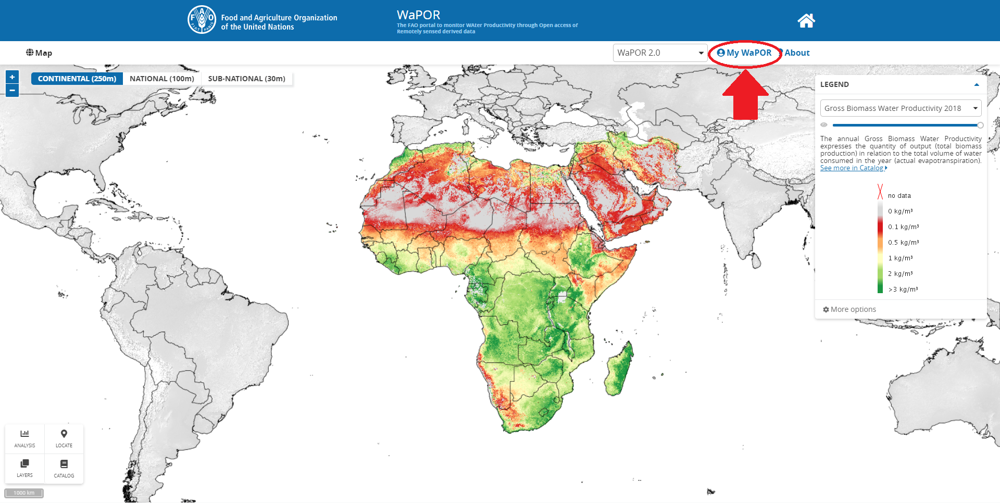
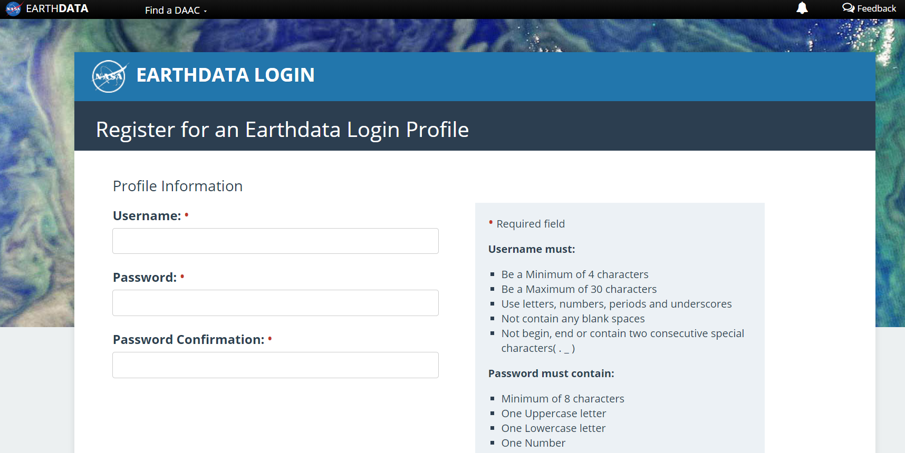
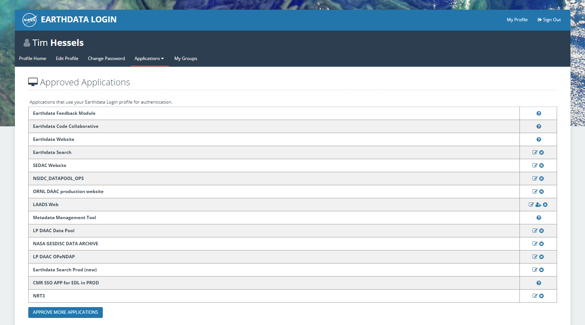

# WaporTranslator
_Usage of the WaPOR dataset for calculating Food Production, Water Productivity, Climate, Drought, and Irrigation Indicators_
___

## 0. Content

0. [Content](#Content)
1. [About WaPOR](#chapter1)
2. [Introduction WaporTranslator](#chapter2)
3. [Installation Anaconda](#chapter3)
4. [Installation QGIS](#chapter4)
5. [Installation WaporTranslator](#chapter5)
	1. [Method 1: Install WaporTranslator automatically](#chapter5_1)
	    1. [Step 1: Download WaporTranslator](#chapter5_1_1)
	    2. [Step 2: Run installation file](#chapter5_1_2)		
    2. [Method 2: Install WaporTranslator manually](#chapter5_2)
		1. [Step 1: Download watertools, WaporAPI, and WaporTranslator](#chapter5_2_1)
		2. [Step 2: Install all the python modules](#chapter5_2_2)
			1. [Method 1: conda](#chapter5_2_2_1)
			2. [Method 2: pip](#chapter5_2_2_2)
			3. [Method 3: wheel](#chapter5_2_2_3) 
			4. [Method 4: python file](#chapter5_2_2_4) 	
6. [Add Environment Variables](#chapter6) 
7. [Required Accounts for WaporTranslator](#chapter7) 
	1. [Account 1: WaPOR](#chapter7_1)
	2. [Account 2: NASA](#chapter7_2)
8. [Run WaporTranslator](#chapter8)	
	1. [Step 1: Open Anaconda prompt](#chapter8_1)	
	2. [Step 2. Activate python environment](#chapter8_2)	
	3. [Step 3. Run WaporTranslator LEVEL 1](#chapter8_3)	
	4. [Step 4. Run WaporTranslator LEVEL 2](#chapter8_4)	
	5. [Step 5. Run WaporTranslator LEVEL 3](#chapter8_5)
9. [LANDSAF option as input](#chapter9) 					
10. [WaporTranslator Indicators](#chapter10)

---
## 1. About WAPOR

[WaPOR](http://www.fao.org/land-water/databases-and-software/wapor/en/) is a open accessible near real time database that use satellite information to monitor different agricultural related parameters like Evapotranspiration, Net Primary Production, and Gross Biomass Water Productivity. At the moment, version 2.0 is launched on 17th of June 2019 and covers on dekadal timescale whole Africa with a spatial resolution of 250 meters. The main riverbasins are covered on a 100m grid, and some parts even have a spatial resolution of 30m. All the dataset area available since 2009 and runs till near real time. 

---
## 2. Introduction WaporTranslator
The WaporTranslator is a python based module, that mainly uses WaPOR data in combination with GLDAS, MODIS, LANDSAF, SoilGrids and SRTM data to calculate multiple indicators for Food Production, Water Productivity, Climate, Drought, and Irrigation.

The tool is made on a 64-bits Windows 10 computer using python 3.7. For calculating large areas, make sure your computer has enough RAM (minimum of 16Gb working memory). For smaller areas a 8Gb RAM would be sufficient.

**Limitation:**
Due to the limitation in solar input, the model is now forced to include a recent year within the analyses. This means that if LANDSAF is used as solar input, the "End_Year" parameter cannot be smaller than 2016 and for KNMI option (default) as solar input this parameter cannot be smaller than 2017.

---

## 3. Installation Anaconda

There are several packages available, which include python. Recommended for the WaporTranslator is to use the python package within Anaconda. The great advantage of using the standard Anaconda package is that most of the commonly used modules are included in the package and also an IDE is included (Spyder). Alternatively, these modules can be installed separately by the user if a different package than Anaconda is preferred. A main advantage of this Anaconda package is the easy installation of the python modules that are included within the Anaconda library. The whole overview of python modules that are already installed or are included in the Anaconda library can be seen [here](https://docs.anaconda.com/anaconda/packages/py3.7_win-64/). 

The Anaconda executable can be downloaded from: [https://www.anaconda.com/distribution/](https://www.anaconda.com/distribution/). It is recommended to download the **64-bits version**, because this will increase the calculation capacity enormously. However, be sure that your computer/laptop is a **64-bits computer/laptop. Otherwise, install the 32-bits version.

The WaporTranslator python module is programmed in **python version 3.7** on a Windows operating systems.

 

After downloading Anaconda you can run the installation of Anaconda by double-click the executable file and follow the automatic installation steps. Choose a logical location for the Anaconda main directory, a logical location is a directory without spaces and preferably near the root folder (C: or D:), the default place is the user folder (C:\Users\username). In the remaining of this document this directory will be called $HOME.
 
The Anaconda package also includes Spyder, which is the IDE (Integrated Development Environment). This is a layout for writing and running python scripts.

---

## 4. Installation QGIS

In order to run all the WaporTranslator functions, there are some necessary executables for running the whole tool properly. For reprojections of the dataset the GDAL functions are required. 

The GDAL package is a geoprocessing toolbox that is also included in QGIS. The easiest way to get this GDAL package is to install QGIS Standalone version on your computer.

* **QGIS:** site: [https://www.qgis.org/en/site/forusers/download.html](https://www.qgis.org/en/site/forusers/download.html)

To make python able to find all the properties of the different projections an required environment variable must be checked and created if needed. Search within the environment variable for the GDAL_DATA variable name. If this variable already exists, there is no need to create this variable again. If not, this variable must be created by yourself. 
For more explanation about how to add an environment user variable go to the [Add Environment Variable](#chapter6) chapter within this document.

If QGIS is installed, the folder with projections information can be found somewhere here “$HOME\Program Files\QGIS x.xx\share\gdal”. create the following environment variable (**do not place a semi column at the end of the variable value**):

>GDAL\_DATA >> $HOME\Program Files\QGIS x.xx\share\gdal

---

## 5. Installation WaporTranslator

There are two options to install the WaporTranslator. Method 1 is to use the installation file that is located in the WaporTranslator package. This will create a new python environment that can run the WaporTranslator functions. Method 2 describes how to install the tool manually. 
Both methods will be further described step by step below:

---

### **5.1 Method 1**: Install WaporTranslator automatically:

To install the WaporTranslator automatically the following steps are needed:

*	**Step 1:** Download WaporTranslator 
*	**Step 2:** Run installation file

The steps mentioned above will be described one by one below.

### Step 1: Download WaporTranslator

Download the WaporTranslator by clicking on the "Clone or download" button located on the top right of the following page: [www.github.com/TimHessels/WaporTranslator](https://www.github.com/TimHessels/WaporTranslator). 

 

After downloading, subtract the data and change the name from "WaporTranslator-master" into "WaporTranslator". 

### Step 2: Run installation file

This method can only be performed if Anaconda is installed. Otherwise the installation has to be done manually as described in the [manual installation](#chapter5_2). Open the windowsOS.yml file (located in the WaporTranslator folder) in a text editor program and change the last line defining the path to the location of Anaconda on your operating system.
The default is set on C:\Username\Anaconda3\envs\env_waportranslator, but replace the 'Username' with the location of your $HOME folder where Anaconda3 folder is located (leave Anaconda3\envs\env_waportranslator on the end of this line).

If you forgot the $HOME folder, you can search by opening the Command Prompt and type:

> dir Anaconda3 /AD /s

After saving the changes within windowsOS.yml file, navigate to the folder where this .yml file is located by opening Anaconda prompt and type:

> cd C:\PATH\TO\DIRECTORY\WaporTranslator

The next step will install all the required modules for the WaporTranslator within a new python environment called env_waportranslator. The installation can be started by typing the following command in the Anaconda prompt:

> conda env create -f windowsOS.yml

If no error is shown, the installation was succesful. If not, try Method 2 to install the specified modules manually that gave the errors during the automated process.

After installation, copy and paste the complete "WaporTranslator" folder within the site-packages location of the new created python environment within the Anaconda3 folder ($HOME\Anaconda3\envs\env_waportranslator\Lib\site-packages). 

---

### **5.2 Method 2**, Install WaporTranslator manually:

To install the WaporTranslator manually the following steps are required:
*	**Step 1:** Download WaporTranslator, watertools, and WaporAPI 
*	**Step 2:** Install required python modules

The steps mentioned above will be described one by one below. 

If during the installation not a new python environment is created the path $HOME\Anaconda3\envs\env_waportranslator\Lib\site-packages will not exists and all the modules will be installed in $HOME\Anaconda3\Lib\site-packages or in the environment name created by yourself. If in the remaining of this manual $HOME\Anaconda3\envs\env_waportranslator\Lib\site-packages is mentioned, you have to go to: $HOME\Anaconda3\Lib\site-packages or if you created an environment by yourself: $HOME\Anaconda3\envs\NAME_OF_YOUR_ENVIRONMENT\Lib\site-packages.

### Step 1: Download watertools, WaporAPI, and WaporTranslator

Three python modules are required all the modules are available on Github. 

(https://www.github.com/TimHessels/watertools) . Click on the "Clone or download" button located on the top right of the window:

 

After downloading, subtract the data and change the name from "watertools-master" into "watertools". Copy and paste the complete "watertools" folder within the site-packages location of Anaconda ($HOME/Anaconda3/Lib/site-packages). 

Do the same for the WaporTranslator tool and the WaporAPI tool.

### Step 2: Install all the python modules

The list below gives an overview of all the required modules for WaporTranslator. The version number that is used during programming of the tool is also shown. The automatical installation installs those modules within a new python environment, this is not required, but to make sure  those modules will not interfere with your current python environment and projects it is advisable to create a new python environment. 

| Modules        | Install Name           | Command  | Used Version |
| ------------- |:-------------| :-----| :-----|
| hdf5    | hdf5 | conda install hdf5 | 1.10.4 |
| numpy | numpy      |  conda install numpy | 1.16.5 |
| bs4 | beautifulsoup4      |  conda install beautifulsoup4 | 4.8.0 |
| gdal | gdal/osgeo       |  conda install gdal | 2.3.3 |
| joblib | joblib      |  conda install joblib | 0.13.2 |
| netCDF4 | netCDF4      |  conda install netCDF4 | 1.4.2 |
| pandas | pandas      |  conda install pandas | 0.25.1 |
| paramiko | paramiko      |  conda install paramiko | 2.6.0 |
| pyproj | pyproj      |  pip install pyproj | 2.4.0 |
| Shapefile | pyshp      |  conda install pyshp  | 2.1.0 |
| requests | requests      |  conda install requests | 2.22.0 |
| scipy | scipy      |  conda install scipy | 1.3.1 |
| pycurl | pycurl      |  conda install pycurl | 7.43.0.3 |
| h5py | h5py      |  conda install h5py | 2.9.0 |
| fiona | fiona      |  conda install fiona | 1.8.4 |
| lxml | lxml      |  conda install lxml | 4.4.1 |

Python modules are function packages that can be imported into your python code. They usually contain stand-alone functions, which can be used within your own python code.

In order to import the WaporTranslator all the modules used in this toolbox must be present. This can be checked by running the following line in Spyder:

>import WaporTranslator

If you get no command everything is fine, if not you will see:

>ImportError: No module named ... module name ...

The missing modules needs to be added manually. The missing module name (that is showing in the ImportError message of python) can be copied (the only exception is "shapefile", this module is called "pyshp" and "osgeo" is called "gdal") and installed by using one of the following 4 methods, the easiest methods are method 1 and 2 which is normally also sufficient to install all the python modules of the WaporTranslator module. If a module cannot be installed by the first method described below, the second method can be used, followed by the third and fourth. After installing one module, close and re-open an Ipython console and check if "import WaporTranslator" can be imported or to see which new module is missing. **Use only for the pyproj module the pip command instead of the conda command!**

#### Method 1: conda

If a package is missing, you can search in the anaconda library by starting the Anaconda prompt and type:  

>conda install ... module name ...

The "conda" command will only work if Anaconda is installed. The module will be downloaded from the conda library and installed on your computer. If multiple python versions are installed, check the current active version within the Anaconda prompt by typing "spyder". This will open a python console mentioning the version name on the top. Below is an example of a command to install the "gdal" module by using the Anaconda library:

 

A specific version of a certain module can be installed by defining the version number behind the module name like this: "conda install gdal==2.3.3". This will install gdal version 2.3.3.

#### Method 2: pip

The following command can also be used within the Anaconda prompt:

>pip install ... module name ...

Below is an example of a command to install the "pyproj" module by using the pypi libary:

 

#### Method 3: wheels

It is also possible to install a module by using a .whl file (wheel-file). The wheels can be downloaded here: [http://pythonwheels.com/](http://pythonwheels.com/) and [http://www.lfd.uci.edu/~gohlke/pythonlibs/](http://www.lfd.uci.edu/~gohlke/pythonlibs/). Select the wheel containing win32 within the name if a 32 bits version of Python is used, and win_amd64 if the 64 bits version is used. After downloading the module wheel file, open command prompt and change the directory to the directory where the .whl file is located. You can change the directory in command prompt by using the cd command, as shown in the example below. 

 

After changing the directory, use the following command within the command prompt to install the module.

>pip install ... name.whl ... 

#### Method 4: python file

If a module consists of a complete folder with a setup.py script inside after unzipping, the module can be installed by opening the command prompt and change the directory ("cd" command) to the path where the setup.py is located. Then you can install the module by using the following command within the command prompt:

>python setup.py install

---

### 6. Add Environment Variables

To add an environment variable, search in windows for the "Environment Variables", and click on the "Edit the system environment variables" option as shown in the figure below:

 

This will pops up the window as shown below. Click on the Environment Variables button in the Advanced tab.

 

For the WaporTranslator two environment variables needs to be created.
*	**PATH 1:** WA_PATHS
*	**PATH 2:** GDAL_DATA

 This can be done in the user environment variables manager by clicking on the "New.." button (see figure below).

 

#### Create environment variables

The environment variables that must be created are for the WA_PATHS variable and the GDAL_DATA variable.

**Path 1: WA_PATHS**

Search for the folder where the GDAL executables like gdalwarp.exe, gdal_translate.exe etc. (see picture on the right) are located (**Do not use the GDAL executables that are stored in the Anaconda3 folder**). 

If QGIS is installed those executables are in “C:\Program Files\QGIS x.xx\bin”, so the following user environment variable must be created:

> WA_PATHS >> $HOME\Program Files\QGIS x.xx\bin

**Path 2: GDAL_DATA**

Search for the folder where the GDAL csv files like gcs.csg, datum_shift.csv etc. (see picture on the right) are located. 

If QGIS is installed those executables are in “C:\Program Files\QGIS x.xx\share\gdal”, so the following user environment variable must be created:

>GDAL\_DATA >> C:\Program Files\QGIS x.xx\share\gdal

### 7. Required Accounts for WaporTranslator

After fulfilling the steps above, the WaporTranslator is installed. The functions that are within the toolbox can be used, to collect the data automatatically some free accounts for authentication are required. 

The following accounts are required for the WaporTranslator:

*	**Account 1:** WaPOR
*	**Account 2:** NASA
---

### Account 1: WaPOR

**Required for:** WaPOR Data

To create a Wapor Account go to FAO's WaPOR webpage: [https://wapor.apps.fao.org/home/WAPOR_2/1](https://wapor.apps.fao.org/home/WAPOR_2/1). And push the Sign in button on the top right of the page. Create an account and sign in.

Go back to the portal page and now the sign in button is replaced by the My WaPOR button. Click on this button, to open your profile. 

 

Select the "My Profile" option. And in the API Token section, you can generate an API Token by clicking on the "Generate API Token" button. 

 

Save this API-KEY somewhere on your computer, this token is needed later to run the WaporTranslator. This token is private and you should not share this token with others!

---

## Account 2: NASA

Within the watertools Toolbox, there are multiple codes to download data automatically, but some datasets requires an account in order to get the data from their server.

 Within the WebAccounts.py file located in the watertools directory ($HOME\Anaconda3\envs\env_waportranslator\Lib\site-packages\watertools) the accounts information can be specified. Open this file in notepad (see picture on the right).

After the server names (NASA, GLEAM, FTP_WA etc..) the authentication information must be specified of this specific server. Between the first pair of apostrophes the username needs to be filled in and between second pair of apostrophes the password needs to be defined. 

For the WaporTranslator only a NASA account is required. With this account you can download GLDAS, MODIS, and TRMM data automatically.
A new NASA account can be created here: [https://urs.earthdata.nasa.gov/users/new](https://urs.earthdata.nasa.gov/users/new). 

**Don't forget to fill in the username and password in the WebAccounts.py!**

 

After the account has been created, login into the earthdata server by using this account: [https://urs.earthdata.nasa.gov/home](https://urs.earthdata.nasa.gov/home)

Go to the "My Applications" tab and check if all the required applications (see picture below) are approved. If one is missing click on the "APPROVE MORE APPLICATIONS" button and search and approve the missing applications. 

 

---

## 8. Run WaporTranslator
The WaporTranslator includes three levels. The first level will download and process all the required datasets. The second level will calculate all the intermediate results that is required to calculate the level 3 indicators. Level 3 will calculate the different indicators. A list of all the calculated indicators can be found in [WaporTranslator Indicators](#chapter9) section of this manual.

All the three levels can be runned from the Anaconda prompt by setting up 1 JSON file. This JSON file should have the following keys and items:

 

An example can also be found in $HOME\Anaconda3\envs\env_waportranslator\Lib\site-packages\WaporTranslator\input_example.txt. 

The inputs are the following:

* **Start_Year** = integer, defining the start year of the analyses (must be 2009 or later)
* **End_Year** = integer, defining the end year of the analyses
* **Input_Shapefile** = string, defining the path to the shapefile (determines the area of interest of the analyses)
* **Threshold_Mask** = interger, value beween 0 and 100 that defines the percentage of the pixel that needs to be within the shapefiles border in order to include within the analyses
* **Output_folder** = string, defines the directory to store the outputs, it will be created if folder does not exists
* **API_WAPOR_KEY** = string, the personal API-WAPOR-TOKEN generated in [Account 1: WaPOR](#chapter7_1) section of this manual

Optional input:
* **Radiation_Source** = string, default is "KNMI", but "LANDSAF" is also possible as radiation source

After creating this file with the inputs, the WaporTranslator can be runned. Using the following steps:

---

### **Step 1. Open Anaconda prompt**

First step is to open Anaconda Prompt of the python version where the WaporTranslator python environment is created. By opening the Anaconda Prompt, the active environment will be the "base" environment (includes the python modules installed in $HOME\Anaconda3\Lib\site-packages). This is indicated by the "(base)" statement in front of the working directory.

 

---
### **Step 2. Activate python environment**

To change the python environment into the one in which the WaporTranslator modules are located the following line can be used (if the environment still has the default env_waportranslator name):

> conda activate env_waportranslator

The Anaconda Prompt will now show the "(env_waportranslator)" in front of the working directory.

 

---
### **Step 3. Run WaporTranslator LEVEL 1**

Now the WaporTranslator can be runned by using the created [JSON file]("#chapter8"). First all the required data will be collected by running level 1 of the WaporTranslator code. Within the Anaconda Prompt the following line can be used to start level 1:

> python "$HOME\Anaconda3\envs\env_waportranslator\Lib\site-packages\WaporTranslator\Run_LEVEL1.py" "C:\PATH\TO\input_example.txt"

The line will start with "python", followed by the python code that has to be runned, and the last input is the path to the [JSON file]("#chapter8").

It can take a while before all the data is collected (depending on the extent and time period of the analyses). Within the output folder a new subfolder is created called "LEVEL1" in here you will see all the dataset that is already collected. It is possible to stop the code at any moment, by pressing ctrl+c in Anaconda Prompt. 
The data collection will be continued by just using the same command and will skip the data that is already collected and stored within the LEVEL1 subfolder.

---
### **Step 4. Run WaporTranslator LEVEL 2**

When Run_LEVEL1.py is finished, Run_LEVEL2.py can be runned by using the following command:

> python "$HOME\Anaconda3\envs\env_waportranslator\Lib\site-packages\WaporTranslator\Run_LEVEL2.py" "C:\PATH\TO\input_example.txt"

The only difference between LEVEL1 and LEVEL2 is the python code that will be used. The input file is still the same JSON file.

LEVEL2 will calculate intermediate results that are required to calculate the WaporTranslator indicators. The data will be stored in a subfolder called "LEVEL2" within the output folder.

---
### **Step 5. Run WaporTranslator LEVEL 3**

The last step is to run Run_LEVEL3.py. This can be done by using the following command:

> python "$HOME\Anaconda3\envs\env_waportranslator\Lib\site-packages\WaporTranslator\Run_LEVEL3.py" "C:\PATH\TO\input_example.txt"

Also here the only difference is the python code that is used. The input file is still the same JSON file.

LEVEL3 will calculate the WaporTranslator indicators catogorized in 5 subfolders. The data will be stored in a subfolder called "LEVEL3" within the output folder.

---
## 9. LANDSAF option as input

The WaporTranslator has two different methods to calculate the net radiation. One method is using the KNMI data. This is also the default option. The KNMI data is downloaded automatically. 

Another option is to use the solar radiation of LANDSAF. This data can be downloaded [here](https://landsaf.ipma.pt/en/). Go to the "Get Data" section on top and select the "Archived Products". Create an account on LSASAF and you can start downloading their data.

After login, the ordering method selection can be selected. If LSASAF's recommended options for data delivery are OK, you can directly click on the proceed button.

 

The next page the data needs to be selected. For the WaporTranslator, two parameters are required, namely the DIDSSF and DIDSLF. Select for the area the MSG Disk and select the required start and end data. The daily data is available since 2015-11-11.

 

After selecting click the proceed button on the bottom of the page. The data will be generated and stored on your specific FTP page: [ftp://landsaf.ipma.pt/LSASAF-Dissemination/**your username**/](ftp://landsaf.ipma.pt/LSASAF-Dissemination/).

After downloading the .bz2 files, create a folder in the LEVEL1 subfolder called "LANDSAF".
Now you can also run the WaporTranslator with the "LANDSAF" as "Radiation_Source" instead of "KNMI".

---
## 10. WaporTranslator Indicators

### **LEVEL 2 Results**

| Parameter Name        | Unit           | Timestep |Link to Python Code  |
| ------------- |:-------------| :-----| :-----| 
| Available_Before_Depletion  | mm | Dekadal | [click here](https://github.com/TimHessels/WaporTranslator/blob/ac9c28e560f91b635bb3abda9260b3aa270a5b01/LEVEL_2/Run_Intermediate_Parameters.py#L657) |
| Critical_Soil_Moisture | cm3/cm3 | Dekadal | [click here](https://github.com/TimHessels/WaporTranslator/blob/ac9c28e560f91b635bb3abda9260b3aa270a5b01/LEVEL_2/Run_Intermediate_Parameters.py#L409) |
| Crop_Coef_Dry_Soil | - | Dekadal | [click here](https://github.com/TimHessels/WaporTranslator/blob/ac9c28e560f91b635bb3abda9260b3aa270a5b01/LEVEL_2/Run_Intermediate_Parameters.py#L138) |
| Crop_Coef_Update | - | Dekadal | [click here](https://github.com/TimHessels/WaporTranslator/blob/ac9c28e560f91b635bb3abda9260b3aa270a5b01/LEVEL_2/Run_Intermediate_Parameters.py#L567) |
| Crop_Water_Requirement | mm/dekadal | Dekadal | [click here](https://github.com/TimHessels/WaporTranslator/blob/ac9c28e560f91b635bb3abda9260b3aa270a5b01/LEVEL_2/Run_Intermediate_Parameters.py#L390) |
| **Cumulative** |  |  | 
| _1. ET0_| Cumulative mm | Dekadal | [click here](https://github.com/TimHessels/WaporTranslator/blob/ac9c28e560f91b635bb3abda9260b3aa270a5b01/LEVEL_2/Phenology.py#L151) |
| _2. Evapotranspiration_ | Cumulative mm | Dekadal | [click here](https://github.com/TimHessels/WaporTranslator/blob/ac9c28e560f91b635bb3abda9260b3aa270a5b01/LEVEL_2/Phenology.py#L151) |
| _3. NPP_ | Cumulative kg/ha | Dekadal | [click here](https://github.com/TimHessels/WaporTranslator/blob/ac9c28e560f91b635bb3abda9260b3aa270a5b01/LEVEL_2/Phenology.py#L151) |
| _4. Precipitation_ | Cumulative mm | Dekadal | [click here](https://github.com/TimHessels/WaporTranslator/blob/ac9c28e560f91b635bb3abda9260b3aa270a5b01/LEVEL_2/Phenology.py#L151) |
| _5. Temperature_ | Cumulative Celcius | Dekadal | [click here](https://github.com/TimHessels/WaporTranslator/blob/ac9c28e560f91b635bb3abda9260b3aa270a5b01/LEVEL_2/Phenology.py#L151) |
| _6. Transpiration_ | Cumulative mm | Dekadal | [click here](https://github.com/TimHessels/WaporTranslator/blob/ac9c28e560f91b635bb3abda9260b3aa270a5b01/LEVEL_2/Phenology.py#L151) |
| Deep_Percolation | mm/dekadal | Dekadal | [click here](https://github.com/TimHessels/WaporTranslator/blob/ac9c28e560f91b635bb3abda9260b3aa270a5b01/LEVEL_2/Run_Intermediate_Parameters.py#L493) |
| Evaporative_Fraction | - |  Dekadal | [click here](https://github.com/TimHessels/WaporTranslator/blob/ac9c28e560f91b635bb3abda9260b3aa270a5b01/LEVEL_2/Run_Intermediate_Parameters.py#L282) |
| Evaporative_Fraction_Long_Term | - | Long Term Dekadal |[click here](https://github.com/TimHessels/WaporTranslator/blob/ac9c28e560f91b635bb3abda9260b3aa270a5b01/LEVEL_2/Run_Intermediate_Parameters.py#L610) |
| Fractional_Vegetation_Cover | - | Dekadal | [click here](https://github.com/TimHessels/WaporTranslator/blob/ac9c28e560f91b635bb3abda9260b3aa270a5b01/LEVEL_2/Run_Intermediate_Parameters.py#L120) |
| LAI | m2/m2      | Dekadal | [click here](https://github.com/TimHessels/WaporTranslator/blob/ac9c28e560f91b635bb3abda9260b3aa270a5b01/LEVEL_2/Run_Intermediate_Parameters.py#L83) |
| Land_Surface_Emissivity (only LANDSAF option) | - | Dekadal | [click here](https://github.com/TimHessels/WaporTranslator/blob/ac9c28e560f91b635bb3abda9260b3aa270a5b01/LEVEL_2/Run_Intermediate_Parameters.py#L162) |
| LU_END | - | Yearly | [click here](https://github.com/TimHessels/WaporTranslator/blob/ac9c28e560f91b635bb3abda9260b3aa270a5b01/LEVEL_2/Phenology.py#L81) |
| Net_Radiation | W/m2 | Dekadal | [click here](https://github.com/TimHessels/WaporTranslator/blob/ac9c28e560f91b635bb3abda9260b3aa270a5b01/LEVEL_2/Run_Intermediate_Parameters.py#L190) |
| Net_Radiation_Long_Term | W/m2 | Long Term Dekadal | [click here](https://github.com/TimHessels/WaporTranslator/blob/ac9c28e560f91b635bb3abda9260b3aa270a5b01/LEVEL_2/Run_Intermediate_Parameters.py#L586) |
| Net_Supply_Drainage | mm/dekadal | Dekadal | [click here](https://github.com/TimHessels/WaporTranslator/blob/ac9c28e560f91b635bb3abda9260b3aa270a5b01/LEVEL_2/Run_Intermediate_Parameters.py#L475) |
| **Phenelogy** |      |   | 
| _1. CropClass_ | - | Yearly | [click here](https://github.com/TimHessels/WaporTranslator/blob/ac9c28e560f91b635bb3abda9260b3aa270a5b01/LEVEL_2/Phenology.py#L151) |
| _2. End_ | DOY | S1/S2 | [click here](https://github.com/TimHessels/WaporTranslator/blob/ac9c28e560f91b635bb3abda9260b3aa270a5b01/LEVEL_2/Phenology.py#L151) |
| _3. Perenial_ | DOY | S1/S2 | [click here](https://github.com/TimHessels/WaporTranslator/blob/ac9c28e560f91b635bb3abda9260b3aa270a5b01/LEVEL_2/Phenology.py#L151) |
| _4. Start_ | DOY | S1/S2 | [click here](https://github.com/TimHessels/WaporTranslator/blob/ac9c28e560f91b635bb3abda9260b3aa270a5b01/LEVEL_2/Phenology.py#L151) |
| Root_Depth | cm | Dekadal | [click here](https://github.com/TimHessels/WaporTranslator/blob/ac9c28e560f91b635bb3abda9260b3aa270a5b01/LEVEL_2/Run_Intermediate_Parameters.py#L102) |
| Soil_Moisture | cm3/cm3 | Dekadal | [click here](https://github.com/TimHessels/WaporTranslator/blob/ac9c28e560f91b635bb3abda9260b3aa270a5b01/LEVEL_2/Run_Intermediate_Parameters.py#L368) |
| Soil_Moisture_Change | mm/dekadal | Dekadal | [click here](https://github.com/TimHessels/WaporTranslator/blob/ac9c28e560f91b635bb3abda9260b3aa270a5b01/LEVEL_2/Run_Intermediate_Parameters.py#L457) |
| Soil_Moisture_End | cm3/cm3  | Dekadal | [click here](https://github.com/TimHessels/WaporTranslator/blob/ac9c28e560f91b635bb3abda9260b3aa270a5b01/LEVEL_2/Run_Intermediate_Parameters.py#L428) |
| Soil_Moisture_Long_Term |  cm3/cm3  | Long Term Dekadal | [click here](https://github.com/TimHessels/WaporTranslator/blob/ac9c28e560f91b635bb3abda9260b3aa270a5b01/LEVEL_2/Run_Intermediate_Parameters.py#L634) |
| Soil_Moisture_Start | cm3/cm3  | Dekadal | [click here](https://github.com/TimHessels/WaporTranslator/blob/ac9c28e560f91b635bb3abda9260b3aa270a5b01/LEVEL_2/Run_Intermediate_Parameters.py#L427) |
| Soil_Water_Holding_Capacity | mm/m | Static | [click here](https://github.com/TimHessels/WaporTranslator/blob/ac9c28e560f91b635bb3abda9260b3aa270a5b01/LEVEL_2/Run_Intermediate_Parameters.py#L351) |
| Storage_Coeff_Surface_Runoff | mm/dekadal | Dekadal | [click here](https://github.com/TimHessels/WaporTranslator/blob/ac9c28e560f91b635bb3abda9260b3aa270a5b01/LEVEL_2/Run_Intermediate_Parameters.py#L511) |
| Surface_Runoff_Coefficient | - | Dekadal | [click here](https://github.com/TimHessels/WaporTranslator/blob/ac9c28e560f91b635bb3abda9260b3aa270a5b01/LEVEL_2/Run_Intermediate_Parameters.py#L548) |
| Surface_Runoff_P | mm/dekadal | Dekadal | [click here](https://github.com/TimHessels/WaporTranslator/blob/ac9c28e560f91b635bb3abda9260b3aa270a5b01/LEVEL_2/Run_Intermediate_Parameters.py#L529) |
| Theta_FC_Subsoil | cm3/cm3 | Static | [click here](https://github.com/TimHessels/WaporTranslator/blob/ac9c28e560f91b635bb3abda9260b3aa270a5b01/LEVEL_2/Run_Intermediate_Parameters.py#L317) |
| Theta_Sat_Subsoil | cm3/cm3 | Static | [click here](https://github.com/TimHessels/WaporTranslator/blob/ac9c28e560f91b635bb3abda9260b3aa270a5b01/LEVEL_2/Run_Intermediate_Parameters.py#L300) |
| Theta_WP_Subsoil | cm3/cm3 | Static | [click here](https://github.com/TimHessels/WaporTranslator/blob/ac9c28e560f91b635bb3abda9260b3aa270a5b01/LEVEL_2/Run_Intermediate_Parameters.py#L334) |

### **LEVEL 3 Results**

#### **Climate Smart**
| Parameter Name        | Unit           | Timestep |Link to Python Code  |
| ------------- |:-------------| :-----| :-----| 
| Carbon_Root_Zone  | kg/ha | Dekadal | [click here](https://github.com/TimHessels/WaporTranslator/blob/ac9c28e560f91b635bb3abda9260b3aa270a5b01/LEVEL_3/Climate_Smart/LEVEL_3_Calc_Climate_Smart.py#L76) |
| Carbon_Sequestration |  kg/ha/dekadal| Dekadal | [click here](https://github.com/TimHessels/WaporTranslator/blob/ac9c28e560f91b635bb3abda9260b3aa270a5b01/LEVEL_3/Climate_Smart/LEVEL_3_Calc_Climate_Smart.py#L100) |
| Climatic_Cooling | Celsius/dekadal | Dekadal | [click here](https://github.com/TimHessels/WaporTranslator/blob/ac9c28e560f91b635bb3abda9260b3aa270a5b01/LEVEL_3/Climate_Smart/LEVEL_3_Calc_Climate_Smart.py#L123) |
| Combating_Soil_Erosion | kg/ha/dekadal | Dekadal | [click here](https://github.com/TimHessels/WaporTranslator/blob/ac9c28e560f91b635bb3abda9260b3aa270a5b01/LEVEL_3/Climate_Smart/LEVEL_3_Calc_Climate_Smart.py#L174) |
| NPP_Change_In_Time | Percentage/year | Static | [click here](https://github.com/TimHessels/WaporTranslator/blob/ac9c28e560f91b635bb3abda9260b3aa270a5b01/LEVEL_3/Climate_Smart/LEVEL_3_Calc_Climate_Smart.py#L215) |
| Soil_Erodibility | - | Static | [click here](https://github.com/TimHessels/WaporTranslator/blob/ac9c28e560f91b635bb3abda9260b3aa270a5b01/LEVEL_3/Climate_Smart/LEVEL_3_Calc_Climate_Smart.py#L157) |
| Sustaining_Rainfall | m3/ha/dekadal | Dekadal | [click here](https://github.com/TimHessels/WaporTranslator/blob/ac9c28e560f91b635bb3abda9260b3aa270a5b01/LEVEL_3/Climate_Smart/LEVEL_3_Calc_Climate_Smart.py#L191) |
| Water_Generation | m3/ha/dekadal | Dekadal | [click here](https://github.com/TimHessels/WaporTranslator/blob/ac9c28e560f91b635bb3abda9260b3aa270a5b01/LEVEL_3/Climate_Smart/LEVEL_3_Calc_Climate_Smart.py#L140) |

#### **Drought**
| Parameter Name        | Unit           | Timestep |Link to Python Code  |
| ------------- |:-------------| :-----| :-----| 
| Accumulated_Rainfall_Deficit  | mm | Dekadal |[click here](https://github.com/TimHessels/WaporTranslator/blob/ac9c28e560f91b635bb3abda9260b3aa270a5b01/LEVEL_3/Drought/LEVEL_3_Calc_Drought.py#L73) |
| ET_Deficit | mm/dekadal | Dekadal | [click here](https://github.com/TimHessels/WaporTranslator/blob/ac9c28e560f91b635bb3abda9260b3aa270a5b01/LEVEL_3/Drought/LEVEL_3_Calc_Drought.py#L56) |
| Integrated_Drought_Alert_Level | Level | Dekadal | [click here](https://github.com/TimHessels/WaporTranslator/blob/ac9c28e560f91b635bb3abda9260b3aa270a5b01/LEVEL_3/Drought/LEVEL_3_Calc_Drought.py#L115) |
| Soil_Moisture_Anomaly | Percentage | Dekadal |[click here](https://github.com/TimHessels/WaporTranslator/blob/ac9c28e560f91b635bb3abda9260b3aa270a5b01/LEVEL_3/Drought/LEVEL_3_Calc_Drought.py#L90) | 

#### **Food Security**
| Parameter Name        | Unit           | Timestep |Link to Python Code  |
| ------------- |:-------------| :-----| :-----| 
| Accumulated_Biomass_Production_Season  | kg/ha/season | Season |[click here](https://github.com/TimHessels/WaporTranslator/blob/ac9c28e560f91b635bb3abda9260b3aa270a5b01/LEVEL_3/Food_Security/LEVEL_3_Calc_Food_Security.py#L345) |
| Accumulated_NPP_Season |  kg/ha/season | Season | [click here](https://github.com/TimHessels/WaporTranslator/blob/ac9c28e560f91b635bb3abda9260b3aa270a5b01/LEVEL_3/Food_Security/LEVEL_3_Calc_Food_Security.py#L283) |
| Actual_Biomass_Production | kg/ha/day | Dekadal | [click here](https://github.com/TimHessels/WaporTranslator/blob/ac9c28e560f91b635bb3abda9260b3aa270a5b01/LEVEL_3/Food_Security/LEVEL_3_Calc_Food_Security.py#L140) |
| AEZ | - | Yearly | [click here](https://github.com/TimHessels/WaporTranslator/blob/ac9c28e560f91b635bb3abda9260b3aa270a5b01/LEVEL_3/Food_Security/LEVEL_3_Calc_Food_Security.py#L127) |
| Grassland | - | Yearly | [click here](https://github.com/TimHessels/WaporTranslator/blob/ac9c28e560f91b635bb3abda9260b3aa270a5b01/LEVEL_3/Food_Security/LEVEL_3_Calc_Food_Security.py#L81) |
| Irrigation | - | Dekadal | [click here](https://github.com/TimHessels/WaporTranslator/blob/ac9c28e560f91b635bb3abda9260b3aa270a5b01/LEVEL_3/Food_Security/LEVEL_3_Calc_Food_Security.py#L77) |
| Irrigation_Maps_Yearly | - | Yearly | [click here](https://github.com/TimHessels/WaporTranslator/blob/ac9c28e560f91b635bb3abda9260b3aa270a5b01/LEVEL_3/Food_Security/LEVEL_3_Calc_Food_Security.py#L99) |
| Mean_Biomass_Production | kg/ha/day | Long Term Dekadal | [click here](https://github.com/TimHessels/WaporTranslator/blob/ac9c28e560f91b635bb3abda9260b3aa270a5b01/LEVEL_3/Food_Security/LEVEL_3_Calc_Food_Security.py#L196) |
| Production_Gap_Soil_Moisture | kg/ha/day | Dekadal | [click here](https://github.com/TimHessels/WaporTranslator/blob/ac9c28e560f91b635bb3abda9260b3aa270a5b01/LEVEL_3/Food_Security/LEVEL_3_Calc_Food_Security.py#L249) |
| Production_Gap_Spatial | kg/ha/day | Dekadal | [click here](https://github.com/TimHessels/WaporTranslator/blob/ac9c28e560f91b635bb3abda9260b3aa270a5b01/LEVEL_3/Food_Security/LEVEL_3_Calc_Food_Security.py#L179) |
| Production_Gap_Temporal | kg/ha/day | Dekadal | [click here](https://github.com/TimHessels/WaporTranslator/blob/ac9c28e560f91b635bb3abda9260b3aa270a5b01/LEVEL_3/Food_Security/LEVEL_3_Calc_Food_Security.py#L217) |
| Soil_Moisture_Stress | - | Dekadal | [click here](https://github.com/TimHessels/WaporTranslator/blob/ac9c28e560f91b635bb3abda9260b3aa270a5b01/LEVEL_3/Food_Security/LEVEL_3_Calc_Food_Security.py#L232) |
| Target_Biomass_Production |kg/ha/day | Dekadal | [click here](https://github.com/TimHessels/WaporTranslator/blob/ac9c28e560f91b635bb3abda9260b3aa270a5b01/LEVEL_3/Food_Security/LEVEL_3_Calc_Food_Security.py#L161) |
| Water_Unlimited_Biomass_Production | kg/ha/season  | Season | [click here](https://github.com/TimHessels/WaporTranslator/blob/ac9c28e560f91b635bb3abda9260b3aa270a5b01/LEVEL_3/Food_Security/LEVEL_3_Calc_Food_Security.py#L266) |
| Yield | kg/ha/season | Season | [click here](https://github.com/TimHessels/WaporTranslator/blob/ac9c28e560f91b635bb3abda9260b3aa270a5b01/LEVEL_3/Food_Security/LEVEL_3_Calc_Food_Security.py#L361) |
| Yield_Fresh_Grass | kg/ha/season | Season | [click here](https://github.com/TimHessels/WaporTranslator/blob/ac9c28e560f91b635bb3abda9260b3aa270a5b01/LEVEL_3/Food_Security/LEVEL_3_Calc_Food_Security.py#L375) |

#### **Irrigation**
| Parameter Name        | Unit           | Timestep |Link to Python Code  |
| ------------- |:-------------| :-----| :-----| 
| Adequacy_Crop_Water_Deficit  | mm/dekadal | Dekadal |[click here](https://github.com/TimHessels/WaporTranslator/blob/ac9c28e560f91b635bb3abda9260b3aa270a5b01/LEVEL_3/Irrigation/LEVEL_3_Calc_Irrigation.py#L227) |
| Adequacy_Relative_Irrigation_Water_Supply | - | Dekadal | [click here](https://github.com/TimHessels/WaporTranslator/blob/ac9c28e560f91b635bb3abda9260b3aa270a5b01/LEVEL_3/Irrigation/LEVEL_3_Calc_Irrigation.py#L141) |
| Adequacy_Relative_Water_Supply | - | Dekadal | [click here](https://github.com/TimHessels/WaporTranslator/blob/ac9c28e560f91b635bb3abda9260b3aa270a5b01/LEVEL_3/Irrigation/LEVEL_3_Calc_Irrigation.py#L124) |
| Degree_Of_Over_Irrigation | - | Dekadal | [click here](https://github.com/TimHessels/WaporTranslator/blob/ac9c28e560f91b635bb3abda9260b3aa270a5b01/LEVEL_3/Irrigation/LEVEL_3_Calc_Irrigation.py#L193) |
| Degree_Of_Under_Irrigation | - | Dekadal | [click here](https://github.com/TimHessels/WaporTranslator/blob/ac9c28e560f91b635bb3abda9260b3aa270a5b01/LEVEL_3/Irrigation/LEVEL_3_Calc_Irrigation.py#L210) |
| Equity_Soil_Moisture | - | Dekadal | [click here](https://github.com/TimHessels/WaporTranslator/blob/ac9c28e560f91b635bb3abda9260b3aa270a5b01/LEVEL_3/Irrigation/LEVEL_3_Calc_Irrigation.py#L365) |
| ET_Savings_Spatial | mm/dekadal | Dekadal | [click here](https://github.com/TimHessels/WaporTranslator/blob/ac9c28e560f91b635bb3abda9260b3aa270a5b01/LEVEL_3/Irrigation/LEVEL_3_Calc_Irrigation.py#L272) |
| ET_Target_Spatial | mm/dekadal | Dekadal | [click here](https://github.com/TimHessels/WaporTranslator/blob/ac9c28e560f91b635bb3abda9260b3aa270a5b01/LEVEL_3/Irrigation/LEVEL_3_Calc_Irrigation.py#L249) |
| ETblue | mm/dekadal| Dekadal | [click here](https://github.com/TimHessels/WaporTranslator/blob/ac9c28e560f91b635bb3abda9260b3aa270a5b01/LEVEL_3/Irrigation/LEVEL_3_Calc_Irrigation.py#L89) |
| ETgap | mm/dekadal | Dekadal | [click here](https://github.com/TimHessels/WaporTranslator/blob/ac9c28e560f91b635bb3abda9260b3aa270a5b01/LEVEL_3/Irrigation/LEVEL_3_Calc_Irrigation.py#L313) |
| Feasible_Water_Conservation | mm/dekadal| Dekadal | [click here](https://github.com/TimHessels/WaporTranslator/blob/ac9c28e560f91b635bb3abda9260b3aa270a5b01/LEVEL_3/Irrigation/LEVEL_3_Calc_Irrigation.py#L330) |
| Gross_Irrigation_Water_Supply | mm/dekadal | Dekadal | [click here](https://github.com/TimHessels/WaporTranslator/blob/ac9c28e560f91b635bb3abda9260b3aa270a5b01/LEVEL_3/Irrigation/LEVEL_3_Calc_Irrigation.py#L106) |
| Irrigation_Water_Requirement | mm/dekadal| Dekadal | [click here](https://github.com/TimHessels/WaporTranslator/blob/ac9c28e560f91b635bb3abda9260b3aa270a5b01/LEVEL_3/Irrigation/LEVEL_3_Calc_Irrigation.py#L72) |
| Mean_Long_Term_Evapotranspiration | mm/dekadal | Long Term Dekadal | [click here](https://github.com/TimHessels/WaporTranslator/blob/ac9c28e560f91b635bb3abda9260b3aa270a5b01/LEVEL_3/Irrigation/LEVEL_3_Calc_Irrigation.py#L290) |
| Non_Beneficial_Water_Losses | mm/dekadal | Dekadal | [click here](https://github.com/TimHessels/WaporTranslator/blob/ac9c28e560f91b635bb3abda9260b3aa270a5b01/LEVEL_3/Irrigation/LEVEL_3_Calc_Irrigation.py#L247) |
| Non_Consumptive_Use_Due_To_Irrigation |  mm/dekadal | Dekadal | [click here](https://github.com/TimHessels/WaporTranslator/blob/ac9c28e560f91b635bb3abda9260b3aa270a5b01/LEVEL_3/Irrigation/LEVEL_3_Calc_Irrigation.py#L159) |
| Onfarm_Irrigation_Efficiency | Percentage | Dekadal | [click here](https://github.com/TimHessels/WaporTranslator/blob/ac9c28e560f91b635bb3abda9260b3aa270a5b01/LEVEL_3/Irrigation/LEVEL_3_Calc_Irrigation.py#L176) |
| Reliability_Soil_Moisture | - | Yearly | [click here](https://github.com/TimHessels/WaporTranslator/blob/ac9c28e560f91b635bb3abda9260b3aa270a5b01/LEVEL_3/Irrigation/LEVEL_3_Calc_Irrigation.py#L383) |

#### **Water Productivity**
| Parameter Name        | Unit           | Timestep |Link to Python Code  |
| ------------- |:-------------| :-----| :-----| 
| AquaCrop_Water_Use_Efficiency  | kg/m2 | Dekadal |[click here](https://github.com/TimHessels/WaporTranslator/blob/ac9c28e560f91b635bb3abda9260b3aa270a5b01/LEVEL_3/Water_Productivity/LEVEL_3_Calc_Water_Productivity.py#L215) |
| GBWP_Decade | kg/m3 | Dekadal | [click here](https://github.com/TimHessels/WaporTranslator/blob/ac9c28e560f91b635bb3abda9260b3aa270a5b01/LEVEL_3/Water_Productivity/LEVEL_3_Calc_Water_Productivity.py#L323) |
| GBWP_Gap | kg/m3 | Dekadal | [click here](https://github.com/TimHessels/WaporTranslator/blob/ac9c28e560f91b635bb3abda9260b3aa270a5b01/LEVEL_3/Water_Productivity/LEVEL_3_Calc_Water_Productivity.py#L292) |
| GBWP_Improvement_Required | Percentage | Dekadal | [click here](https://github.com/TimHessels/WaporTranslator/blob/ac9c28e560f91b635bb3abda9260b3aa270a5b01/LEVEL_3/Water_Productivity/LEVEL_3_Calc_Water_Productivity.py#L310) |
| GBWP_Season | kg/m3 | Season | [click here](https://github.com/TimHessels/WaporTranslator/blob/ac9c28e560f91b635bb3abda9260b3aa270a5b01/LEVEL_3/Water_Productivity/LEVEL_3_Calc_Water_Productivity.py#L249) |
| GBWP_Target | kg/m3 | Dekadal | [click here](https://github.com/TimHessels/WaporTranslator/blob/ac9c28e560f91b635bb3abda9260b3aa270a5b01/LEVEL_3/Water_Productivity/LEVEL_3_Calc_Water_Productivity.py#L275) |
| Normalized_GBWP_Max_Per_TBP | kg/m3 | Dekadal | [click here](https://github.com/TimHessels/WaporTranslator/blob/ac9c28e560f91b635bb3abda9260b3aa270a5b01/LEVEL_3/Water_Productivity/LEVEL_3_Calc_Water_Productivity.py#L335) |
| Normalized_GBWP_Min_Per_TBP | kg/m3  | Dekadal | [click here](https://github.com/TimHessels/WaporTranslator/blob/ac9c28e560f91b635bb3abda9260b3aa270a5b01/LEVEL_3/Water_Productivity/LEVEL_3_Calc_Water_Productivity.py#352) |
| T_Efficiency | mm/dekadal| Dekadal | [click here](https://github.com/TimHessels/WaporTranslator/blob/ac9c28e560f91b635bb3abda9260b3aa270a5b01/LEVEL_3/Water_Productivity/LEVEL_3_Calc_Water_Productivity.py#L78) |
| Water_Productivity | kg/m3| Season | [click here](https://github.com/TimHessels/WaporTranslator/blob/ac9c28e560f91b635bb3abda9260b3aa270a5b01/LEVEL_3/Water_Productivity/LEVEL_3_Calc_Water_Productivity.py#L386) |
| Water_Productivity_Score | - | Dekadal | [click here](https://github.com/TimHessels/WaporTranslator/blob/ac9c28e560f91b635bb3abda9260b3aa270a5b01/LEVEL_3/Water_Productivity/LEVEL_3_Calc_Water_Productivity.py#L369) |

---